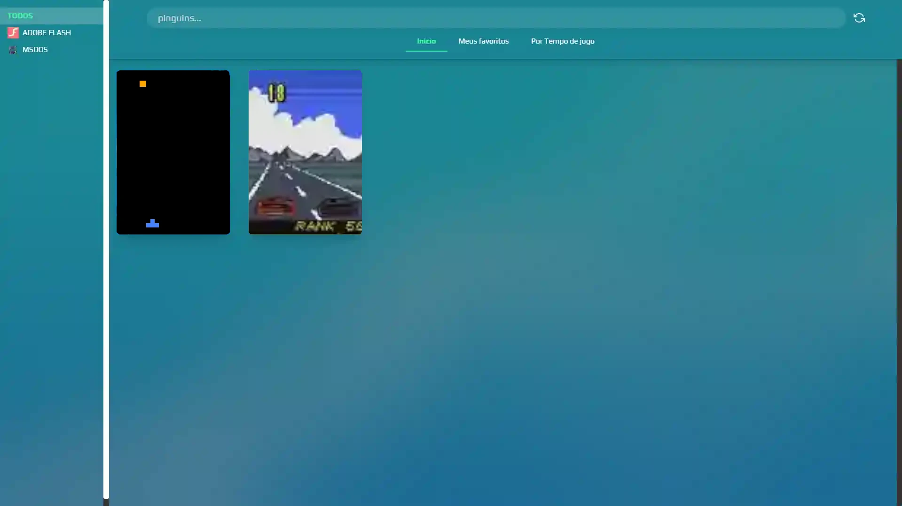
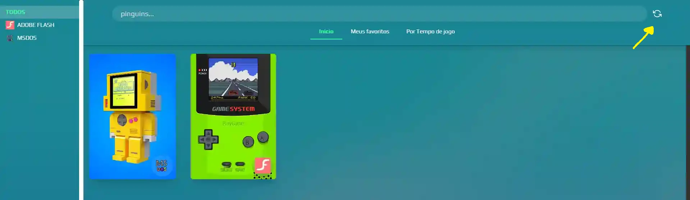

# Introdução



Esse é um frontend com scrapper local que conecta emuladores a jogos, com o foco em jogos retro, e podendo ser expandido a quase qualquer formato.

> Esse frontend não tem os jogos, imagens, descrições, emuladores ou qualquer dado proprietário, nem fornece apis para baixar automaticamente por questões legais, sendo apenas um frontend onde você pode adicionar os jogos, as imagens, e realizar as configurações necessárias explicadas na seção de configurações.

As configurações podem ser automatizadas com scripts externos, mas não está no escopo desse repositório.

## Roda no meu PC?

Esse projeto é feito para PC Windows e Linux, e funciona em ambas as plataformas, provavelmente deve ser possível realizar compilações para MacOs, já que esse projeto usa o [electronjs](https://www.electronjs.org/pt/).

## Rodando e configurando o retrostation

Abaixo um tutorial completo sobre como configurar os jogos, runners e outros detalhes.

> Runners são qualquer forma de rodar os seus arquivos, no contexto de retro emulação, a maioria dos runners serão emuladores, dos quais você irá baixar e configurar por sua conta.

1. Baixe o arquivo .exe pelas releases [link assim que tiver release].
2. Execute o arquivo retrostation.bat, ele irá executar o executável e manterá a CLI presa para você acompanhar os logs para o caso de problemas e dev report.
3. Provavelmente o Windows pedirá permissão para ele rodar o retrostation em algumas portas do seu computador, isso acontece porque o frontend retrostatrion precisa de criar um servidor local (que roda e encerra com o frontend), para servir as imagens e workers utilizadas no frontend.
4. O aplicativo será aberto em tela cheia, e já com alguns EXEMPLOS de jogos. Não são jogos reais, apenas simulações, é um exemplo que você pode apagar customizar de acordo com suas necessidades.

Nesse começo, o aplicativo criará diversas pastas, ficando dessa forma

### assets

- games/formato/ - coloque imagens otimizadas de jogos aqui
- platforms - coloque imagens das plataformas aqui

Exemplo de como pode ficar essa pasta

**games/SWF_FLASH/pinguinsWars.png**

> Otimize suas imagens, minha sugestão é você usar webp com pelo menos 80% de perda de qualidade. Capas de jogos podem ser extremamente pesadas e deixarem o seu computador lento.

### bin

Aqui estão os binários do retrostation, não mexa nessa pasta

### config

- descriptions.json - Você pode deixar descrições dos jogos, basta preencher os campos e deixar um fileName similar ao nome do arquivo.
- plataforms.json - As plataformas que você tem disponível, com imagens na pasta `assets/plataforms`. OTIMIZE suas imagens, elas podem pesar muito na listagem, a sugestão é você converter as imagens para webp preservando apenas 20% da qualidade, normalmente é uma boa forma de fazer isso.
- runnersByFolder.json - Os runners ou emuladores que irão executar dentro de cada pasta.

Eles são chamadas do Runners porque emulador é apenas uma forma de se usar os runners, os runners são qualquer forma de executar os seus arquivos, eles são mapeados de duas formas, que são:

> Existem sites que podem te fornecer mais dados de descrições, e inclusive você pode usar ia.

#### Mapeamento do Runner lendo arquivos individuais dentro de pastas

Esse é o caso mais comum, você define uma pasta onde irá hospedar seus jogos em um determinado formato, e pode ou não deixar eles em subpastas, exemplo

```json
[
  {
    "folder": "SWF_FLASH",
    "map": {
      "mode": "file",
      "extensionFile": ".swf",
      "ignoreFiles": ["bios.swf"]
    },
    "runners": [
      {
        "platform": "win32",
        "name": "",
        "message": "",
        "command": "../content/runners/ruffle-nightly-2024_12_05-windows-x86_64/ruffle.exe \"$gamePath\""
      }
    ]
  }
]
```

A configuração acima buscará na pasta `/content/games/SWF_FLASH` qualquer arquivo em qualquer nível que termine com a extensão .swf, o sistema tem a inteligência de encontrar variações da sua extensão, como `.SWF` em maiúsculo.

Você pode usar o `ignoreFiles`, no exemplo `"ignoreFiles": ["bios.swf"]` ele irá ignorar arquivos que contenham o texto `"bios.swf"``, isso é útil para ignorar dependências de jogos, em especial para formatos super antigos onde cada jogo era montado com diferentes arquivos.

Note que foi usado a string `$gamePath`, ao usa-la, o retrostation irá injetar o caminho do jogo nessa string

#### Mapeamento Runner lendo Pastas

Essa forma foi criada para atender a casos onde é impossível de saber com precisão qual que é o arquivo de entrada do jogo, dessa forma, ao invés de mapear os arquivos, você pode mapear a pasta, e você precisará de configurar o seu runner/emulador para considerar essa pasta, no exemplo abaixo, ele abre o msdos com as pastas do jogo, então é só escolher qual arquivo que inicia o jogo.

```json
[
  {
    "folder": "EXE_MSDOS",
    "map": {
      "mode": "folder"
    },
    "runners": [
      {
        "platform": "win32",
        "name": "DOSBox-X",
        "message": "Na CLI, tente rodar o .exe ou .bat. É só digitar o nome do jogo com a extensão e pressionar Enter.",
        "command": "../content/runners/mingw-dosbox/dosbox-x.exe -conf ../content/runners/mingw-dosbox/dosbox-x.conf -c \"mount D \\\"$gameFolder\\\"\" -c \"D:\" -c \"dir\" "
      }
    ]
  }
]
```

Note que foi usado a string `$gameFolder`, ao usá-la, o retrostation irá injetar o caminho da pasta nessa string

A `platform` pode ser `win32` para windows 32 ou 64 bits, e `linux` para linux.

### cache

Esse é o resultado do scrapper que o retrostation irá realizar sempre que você apertar o botão de refresh, ele contém o mapeamento dos jogos, com a localização dos jogos, as descrições, imagens e demais informações.



O sistema pode abrigar jogos usando alguns padrões comuns, como

- pinguinwars.swf
- pinguinwars (br).swf

Todos esses jogos ficarão juntos visualmente, e você poderá rodar eles separadamente, mas eles ficarão agrupados na mesma imagem e descrição

### content

São nessas pastas onde você irá deixar os `runners`, abaixo alguns exemplos de runners

- content/runners/mingw-dosbox/dosbox-x.exe
- content/runners/ruffle-nightly-2024_12_05-windows-x86_64/ruffle.exe

e `games`

- content/games/SWF_FLASH/pinguinsWars.swf
- content/games/SWD_FLASH/pinguinsWars.swd
- content/games/DOS_MSDOS/SemNome/any.exe

Nos meus testes foi interessante ter o formato e o nome da plataforma, como `SWF_FLASH``, isso permite multiplos formatos de uma plataforma, e isso permite que diferentes runners rodem de dorma diferente esses arquivos.

### data

Essa pasta contém basicamente dados do usuário, como preferências e tempo jogado nas plataformas `user.json`

### retrostation.bat

Esse é o arquivo usado para iniciar o app

## Concluindo configurações

Com as configurações acima você finalmente poderá usar e expandir o retrostation. É muita configuração, mas é a intenção desse projeto, em especial a lidar com jogos bem abandonados, cujos não tem nem no Google direito.

## Links Úteis

- [A Importância da EMULAÇÃO no Mundo dos Games](https://www.youtube.com/watch?v=XUDbvaZBX9w)
- [Para baixar jogos em flash](https://archive.org/details/450jogos-bestgames)
- [Para baixar Abandonware](https://www.myabandonware.com)
- [Para obter núcleos do para o retro arch](https://buildbot.libretro.com/nightly/windows/x86_64/latest/)
- [Arquivo do flashplayer](https://flashpointarchive.org/)
- [Mais jogos em flash](https://archive.org/details/softwarelibrary_flash_games)
- [Emulador Ruffle](https://ruffle.rs/)

> Nos testes, e emulador https://ruffle.rs/ rodou muito bem na versão nightly de 2024-12_05 no windows-x86_64

## Como contribuir?

Você pode sugerir melhorias e até enviar pull requests, desde que não inclua descrições, arquivos, emuladores ou qualquer outro material protegido, mesmo que abandonado. Não contamine esse repositório com código problemático.

## Algumas questões técnicas

1. Porque não tem testes

Ainda vai ter, esse projeto anteriormente era privado e feito no tempo livre do tempo livre, e foi preciso várias iterações até termos a versão atual, isso significou que inúmeros testes foram alterados, e isso acontecia em uma frequência que não os tornou viável de se manter. Testes manuais foram mais produtivos. Mas nada impede termos testes automatizados, eu gosto muito inclusive.

2. Por que o app binário tem mais de 200 mb?

Infelizmente é o electron, alguns testes com uma versão básica dele, sozinho chegava a 190MB, sem incluir os pacotes de idiomas e licenças do chrome. É uma opção migrarmos para outra tecnologia.

3. Posso sugerir outros layouts?

Claro que sim, a versão atual foi feita para tentar lembrar um estilo mais antigo de `fruit gear aero`, mas com pouco tempo.

4. Por que tantas configurações manuais?

Foi feito assim para ser flexivel e para que ele lidasse com formatos diferentes de jogos, até pensei em criar um sistema que baixasse automaticamente descrições e imagens, mas acredito que seria uma questão legalmente complexa, portanto a plataforma não inclui nada disso. Existem alternativas melhores do que essa plataforma para retro emulação, mas não para as necessidades que eu estava precisando.

5. Porque os primeiros commits já tem a aplicação praticamente toda pronta?

Poque esse projeto originalmente era privado, e continha commits que foram contaminados com imagens e descrições de um CD antigo de jogos flash (Como comentei, a origem desse projeto é lidar com jogos flash e outros mais antigos), provavelmente as imagens tinham direitos autorais, dessa forma, nessa versão final publica, tudo foi recomeçado para evitar problemas.

## Aviso legal

Esse projeto foi feito para fins de facilitar a gestão de jogos antigos, como aqueles de cd flash, msdos e outros mais antigos e apenas demonstra ser configurado, sem incluir nenhum jogo, ROM, emulador ou material protegido por direitos autorais. As imagens usadas nos exemplos são apenas para fins de demonstração e em baixa qualidade, todo o uso fica por conta do usuário final.

Os arquivos .exe e .swf na pasta static são apenas arquivos de texto, apenas com a extensão ajustada para servir como exemplo.

## Licenças de conteudo de terceiros

**Som de digitando**
PSS560_Perc1_PROCESSED.aif by Crabflag -- https://freesound.org/s/559408/ -- License: Creative Commons 0

**Som de click**
jump2.wav by LloydEvans09 -- https://freesound.org/s/187024/ -- License: Attribution 4.0

**Som de hover**
Hover 2 by plasterbrain -- https://freesound.org/s/237421/ -- License: Creative Commons 0
